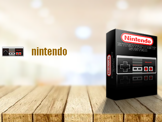
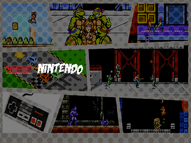
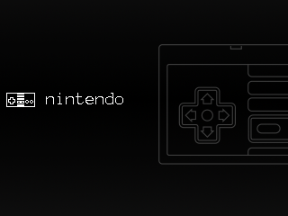
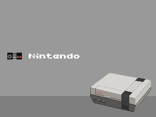

# Retro Go Themes
> Themes for [Ducalex Retro Go](https://github.com/ducalex/retro-go)

## Overview

This is a collection of Themes you can install for your Odroid Go that is runnning [Ducalex Retro Go](https://github.com/ducalex/retro-go) emulation.

## Installation
> Clone, Mount, Copy, Paste

* Mount Your SD Card
* In `retro-go` create a `theme` folder
* Select your *theme* from this repo
* Copy all the images from inside that theme folder
* Paste to your SD card in the `theme` folder (currently only one theme at a time is supported)
* Eject your SD Card
* Mount yoru SD Card in your Odroid Go
* Enjoy

## Current Themes
> What's available

| Theme | Preview |
|--|--|
| Box | |
| Comic Book | |
| Noir | |
| Pixel | |

-----

## Support

> Although we do this for 💕 of 🕹️ 
> **We Also Like Coffee!**  
> *Please Consider Supporting*  

Did you know, you can support us in a few way? We offer multiple sponsorship tiers, with different rewards!

Take a *look*. 
See what *fits*.

 

**Thank You**